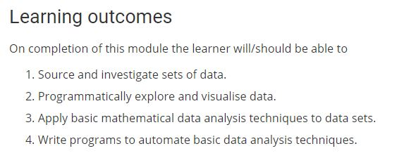

# Practical Assignment - Fundamentals of Data Anlysis

This repository is for an assignemnt to be submitted for the module Fundamentals of Data Analysis.The learning outcomes for this module are listed below and this module forms part of my Dipolma course.

It is based on Anscombe's quartet of datasets.
It is in the form a Jupyter notebook explaining the background of the datasets with analysis and interpretations.
The notebook contains Python code only.
Software used to make this repository: Anaconda version 3.6.5; Jupyter notebook version 5.50; Visual Studio Code version 1.28.

